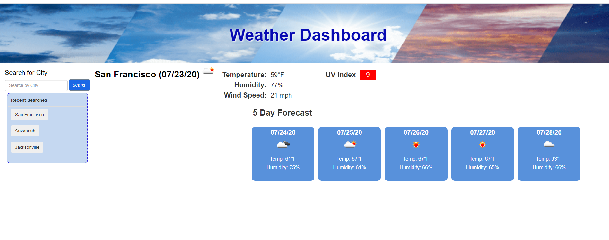

# Weather Dashboard

An interactive weather dashboard app designed for travellers who want to see the weather outlook for multiple cities. Utilizing the OpenWeather API, the app retieves weather data for any city the traveller enters into the search box.

## Features

When traveller initially opens the app, the last saved city current and five day forecast will display.

Traveller can then enter a city in the search box and press the search button to bring up the city and current date and:

1. City and date
2. Weather Condition Icon 
3. Temperature
4. Humidity
5. Wind speed
6. UV Index (UV index also includes a color code.
 a. Favorable (2 or lower) = green
 b. Moderate (3-7) = yellow
 c. Severe (8 or over) = red

Additionally, a five day forecast is displayed with each of the five day's:

1. Date
2. Weather Condition Icon 
3. Temperature
4. Humidity

## My Approach
I made two separate calls to the Open Weather API. The first to retieve latitude and longitude of the city that was searched. The next call uses the lat and lon to bring up the detailed One Call response that includes current UV Index for the city as well as the 5 day forecast detail needed for the future forecast.

I used local storage to retrieve the searched cities snd add them to the recent search column.

Last thing I was working on when I ran out of time was using each of the recent search city buttons city name data to launch the getWeather function.

## Screenshot

